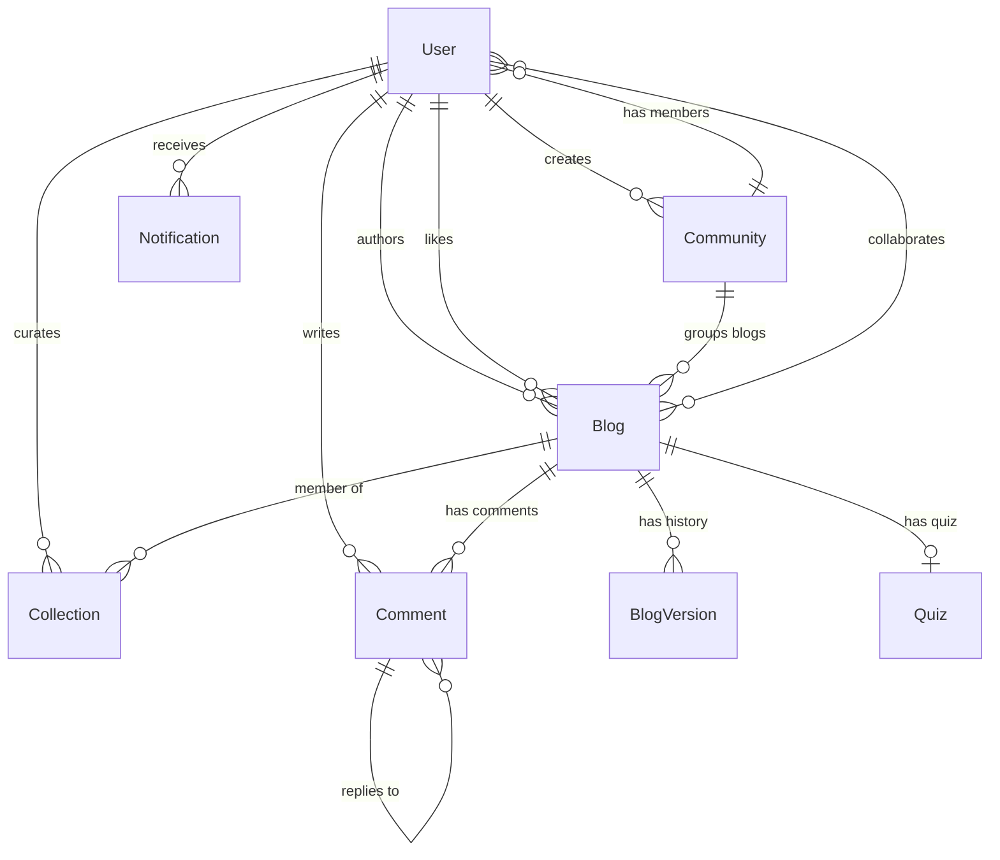

# BlogSphere Database Schema Documentation

This document describes the MongoDB database structure of the BlogSphere platform. The database uses Mongoose schemas to structure the collections, model relationships, enforce validation constraints, and define indexes.

---

## Entity-Relationship Diagram

The diagram below shows the relationships between the database collections.

---

## 1. User Model (`User`)

Stores details for readers, authors, and administrators.

| Field | Type | Attributes / Validation | Default | Description |
| :--- | :--- | :--- | :--- | :--- |
| `name` | String | `required`, `trim` | — | Full name of the user |
| `username` | String | `unique`, `sparse`, `lowercase`, `trim` | — | Unique user identifier (social handle) |
| `email` | String | `required`, `unique`, `lowercase`, `trim` | — | User's email address |
| `googleId` | String | `unique`, `sparse` | — | OAuth ID if signed in via Google |
| `password` | String | Optional | — | Hashed password |
| `bio` | String | Optional | `""` | User's bio description |
| `profileImage` | String | Optional | `""` | URL to the user's avatar image |
| `role` | String | `enum: ['reader', 'author', 'admin']` | `'reader'` | System authorization role |
| `isPrivate` | Boolean | Optional | `false` | If true, strips profile details for other viewers |
| `reputationPoints` | Number | Optional | `0` | Calculated user gamification points |
| `badge` | String | Optional | `'Reader'` | User tier badge name |
| `followers` | Array | `[ObjectId]` -> `User` | `[]` | Users following this user |
| `following` | Array | `[ObjectId]` -> `User` | `[]` | Users this user is following |
| `savedBlogs` | Array | `[ObjectId]` -> `Blog` | `[]` | Saved bookmarks list |
| `newsletterSubscribers` | Array | `[ObjectId]` -> `User` | `[]` | Users subscribed to this author's newsletter |
| `subscribedCategories` | Array | `[String]`, `trim` | `[]` | Extrapolated categories user is interested in |
| `hiddenTags` | Array | `[String]`, `trim` | `[]` | Extrapolated hidden interest tags |
| `collections` | Array | `[ObjectId]` -> `Collection` | `[]` | Curated collections owned by this user |
| `followedCollections` | Array | `[ObjectId]` -> `Collection` | `[]` | Curated collections this user follows |
| `socialLinks` | Object | Nested fields | `{}` | Social handles: `twitter`, `github`, `website` |
| `isVerified` | Boolean | Optional | `false` | Displays "Verified Creator" badge if true |
| `createdAt` | Date | Optional | `Date.now` | User registration timestamp |

---

## 2. Blog Model (`Blog`)

Contains articles, analytics, status, and localization translations.

| Field | Type | Attributes / Validation | Default | Description |
| :--- | :--- | :--- | :--- | :--- |
| `title` | String | `required`, `trim` | — | The headline of the article |
| `slug` | String | `required`, `unique` | — | SEO URL friendly representation of title |
| `content` | String | `required` | — | HTML/Markdown article body |
| `coverImage` | String | Optional | `""` | URL to the cover picture |
| `author` | ObjectId | `required` -> `User` | — | References the creator of the blog |
| `category` | String | `trim` | `""` | The primary category categorization |
| `tags` | Array | `[String]`, `trim` | `[]` | List of tags associated with the post |
| `likes` | Array | `[ObjectId]` -> `User` | `[]` | Users who liked this article |
| `reactions` | Object | Nested reaction arrays | `{}` | Array of user IDs for: `thumbsUp`, `heart`, `clap`, `laugh` |
| `views` | Number | Optional | `0` | Total hits on the article |
| `bounces` | Number | Optional | `0` | Views where user left immediately |
| `completions` | Number | Optional | `0` | Views where user read the article completely |
| `totalReadTime` | Number | Optional | `0` | Cumulative milliseconds spent reading |
| `reports` | Array | Sub-documents | `[]` | Flagged reports details: `userId`, `reason`, `createdAt` |
| `community` | ObjectId | -> `Community` | `null` | References parent community if shared there |
| `isAnonymous` | Boolean | Optional | `false` | True if the author wants to stay anonymous |
| `status` | String | `enum: ['draft', 'published', 'scheduled']` | `'draft'` | Current lifecycle stage of the article |
| `scheduledPublishTime` | Date | Optional | `null` | Date/time to publish when scheduled |
| `collaborators` | Array | `[ObjectId]` -> `User` | `[]` | List of co-authors |
| `summary` | String | Optional | `""` | AI generated summary of the content |
| `keyPoints` | Array | `[String]` | `[]` | Key takeaways generated by AI |
| `translations` | Array | `[TranslationSchema]` | `[]` | Multilingual copies: languages `['en', 'hi', 'gu']` |
| `createdAt` | Date | Optional | `Date.now` | Creation timestamp |
| `updatedAt` | Date | Optional | `Date.now` | Updated timestamp |

### Virtuals
- **`collections`**: Populates all collections that include this blog in their items list (`foreignField: 'items.blog'`).

---

## 3. Collection Model (`Collection`)

Represents a curated folder of blogs.

| Field | Type | Attributes / Validation | Default | Description |
| :--- | :--- | :--- | :--- | :--- |
| `title` | String | `required`, `trim`, `maxlength: 100` | — | Title of the collection |
| `slug` | String | `required`, `unique`, `lowercase`, `index` | — | Auto-generated SEO friendly URL slug |
| `description` | String | `maxlength: 2000` | `""` | Details about the collection |
| `coverImage` | String | Optional | `""` | Cover thumbnail image url |
| `curator` | ObjectId | `required`, `index` -> `User` | — | References the user managing it |
| `collaborators` | Array | `[ObjectId]` -> `User` | `[]` | Co-curators of the folder |
| `visibility` | String | `enum: ['public', 'unlisted', 'private']` | `'private'` | Visibility flag |
| `items` | Array | `[CollectionItemSchema]` | `[]` | References to blogs with ordering and custom notes |
| `itemsCount` | Number | Optional | `0` | Number of items inside (auto-calculated) |
| `followers` | Array | `[ObjectId]` -> `User` | `[]` | Users following this folder |
| `followersCount` | Number | Optional | `0` | Number of followers (auto-calculated) |
| `tags` | Array | `[String]`, `trim`, `lowercase` | `[]` | Categorization tags |
| `category` | String | `trim` | — | Primary category |
| `metaTitle` | String | `maxlength: 60` | — | SEO optimized metadata title |
| `metaDescription` | String | `maxlength: 160` | — | SEO optimized metadata summary |
| `viewsCount` | Number | Optional | `0` | Total views count |
| `sharesCount` | Number | Optional | `0` | Total shares count |
| `createdAt` | Date | Optional | `Date.now` | Creation date |
| `updatedAt` | Date | Optional | `Date.now` | Updated date |

### Indexes
- `{ curator: 1, createdAt: -1 }`
- `{ visibility: 1, createdAt: -1 }`
- `{ followers: 1 }`
- `{ tags: 1 }`
- `{ 'items.blog': 1 }`

---

## 4. Comment Model (`Comment`)

Nested commenting system for blogs.

| Field | Type | Attributes / Validation | Default | Description |
| :--- | :--- | :--- | :--- | :--- |
| `blogId` | ObjectId | `required` -> `Blog` | — | References the article commented on |
| `userId` | ObjectId | `required` -> `User` | — | References the author of the comment |
| `text` | String | `required`, `trim` | — | Plain text message |
| `parentComment` | ObjectId | -> `Comment` | `null` | References the parent comment if a reply |
| `createdAt` | Date | Optional | `Date.now` | Timestamp |

---

## 5. Community Model (`Community`)

Supports group channels and community-specific posting.

| Field | Type | Attributes / Validation | Default | Description |
| :--- | :--- | :--- | :--- | :--- |
| `name` | String | `required`, `unique`, `trim` | — | Name of the community |
| `description` | String | Optional | `""` | Summary of the purpose of the group |
| `creator` | ObjectId | `required` -> `User` | — | References the owner who created it |
| `members` | Array | `[ObjectId]` -> `User` | `[]` | List of member users |
| `createdAt` | Date | Optional | `Date.now` | Creation date |

---

## 6. Blog Version Model (`BlogVersion`)

Maintains editorial content history and revisions.

| Field | Type | Attributes / Validation | Default | Description |
| :--- | :--- | :--- | :--- | :--- |
| `blogId` | ObjectId | `required` -> `Blog` | — | References the article of this version |
| `title` | String | `required` | — | The title at that version |
| `content` | String | `required` | — | Content at that version |
| `versionNumber` | Number | `required` | — | Incrementing version index (1, 2, 3...) |
| `editedBy` | ObjectId | `required` -> `User` | — | References the user who performed the edit |
| `createdAt` | Date | Optional | `Date.now` | Timestamp |

---

## 7. Quiz Model (`Quiz`)

Interactive user feedback and testing for blogs.

| Field | Type | Attributes / Validation | Default | Description |
| :--- | :--- | :--- | :--- | :--- |
| `blogId` | ObjectId | `required`, `unique` -> `Blog` | — | References parent article |
| `questions` | Array | Sub-documents | `[]` | Array of `{ question: String, options: [String], correctAnswerIndex: Number }` |
| `createdAt` | Date | Optional | `Date.now` | Creation date |

---

## 8. Notification Model (`Notification`)

Live updates and system alerts for users.

| Field | Type | Attributes / Validation | Default | Description |
| :--- | :--- | :--- | :--- | :--- |
| `userId` | ObjectId | `required` -> `User` | — | Recipient of the notification |
| `message` | String | `required` | — | Human-readable alert description |
| `isRead` | Boolean | Optional | `false` | True if the notification has been seen |
| `type` | String | `required`, `enum: [...]` | — | Notification category: `follow`, `comment`, `like`, `collab`, `newsletter`, `reaction`, `collection_added`, `collection_followed`, etc. |
| `referenceId` | ObjectId | `required` | — | References related document (e.g. `Blog` ID, `User` ID, `Collection` ID) |
| `createdAt` | Date | Optional | `Date.now` | Alert timestamp |

---

## 9. Daily Brief Model (`DailyBrief`)

Daily summaries of published blogs and themes.

| Field | Type | Attributes / Validation | Default | Description |
| :--- | :--- | :--- | :--- | :--- |
| `date` | String | `required`, `unique` | — | Format: `YYYY-MM-DD` |
| `blogsCount` | Number | `required` | `0` | Number of blogs published on this day |
| `summary` | String | Optional | `""` | AI generated overview text |
| `keyThemes` | Array | `[String]` | `[]` | Key themes extracted by AI |
| `createdAt` | Date | Optional | `Date.now` | Timestamp |

---

## 10. Restricted Word Model (`RestrictedWord`)

Allows moderation filtering of restricted expressions.

| Field | Type | Attributes / Validation | Default | Description |
| :--- | :--- | :--- | :--- | :--- |
| `word` | String | `required`, `unique`, `trim`, `lowercase` | — | Restricted keyword expression |
| `createdAt` | Date | Optional | `Date.now` | Creation date |
