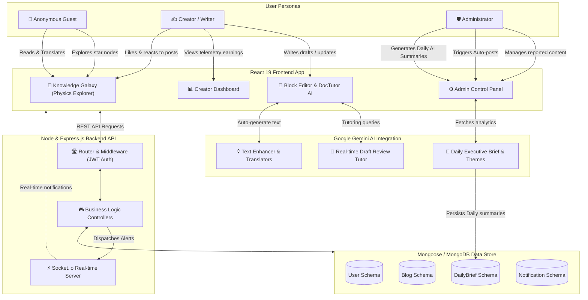

# System Interaction & User Flow Map 📊

This document maps out the system architecture, user personas, backend routes, database stores, and AI integration boundaries of the **Smart Community Blog Platform**.

---

## 1. Interaction Diagram

Below is the architectural flow showing how frontend components, user roles, backend routers, MongoDB schemas, and Google Gemini AI services interact.

---

## 2. User Roles & Capabilities

| Role | Core Capabilities | System Interactions |
| :--- | :--- | :--- |
| **👤 Anonymous Guest** | • Read published blogs. • Perform basic translations. • Interact with the Knowledge Galaxy. | • Query `GET /api/blogs` • Read Canvas nodes. |
| **✍️ Registered Creator** | • Create & edit blog drafts. • Use DocTutor review feedback. • React, comment, and like articles. • Track earnings metrics (views, reactions). | • Write to `Blog` Schema. • Listen to real-time notifications via WebSockets. • Retrieve analytics telemetry. |
| **🛡️ Platform Admin** | • Promote/demote user profiles. • Dismiss or delete flagged posts. • View creator earnings ledger. • Compile and generate Daily AI Briefs. | • Query `DailyBrief` Mongoose model. • Route requests to Gemini AI API. • Moderation controls. |

---

## 3. Core Subsystems

1. **Vite / React 19 Frontend**: Renders user interfaces, visual Knowledge Galaxy canvas (panning/zooming star layouts), editor blocks, and theme configs.
2. **Express & Node API Server**: Shields backend operations with JWT authentication middleware and serves telemetry analytics.
3. **MongoDB Data Layer**: Models platform states:
   * [User.js](file:///c:/Users/Dell/Desktop/Blog/src/server/models/User.js) (Auth details & reputation ledger)
   * [Blog.js](file:///c:/Users/Dell/Desktop/Blog/src/server/models/Blog.js) (Articles, translation arrays, block JSONs)
   * [DailyBrief.js](file:///c:/Users/Dell/Desktop/Blog/src/server/models/DailyBrief.js) (Daily executive reports)
4. **Google Gemini 2.5 Flash API**: powers text enhancing, draft auditing (DocTutor), automated publishing, and admin summaries.
